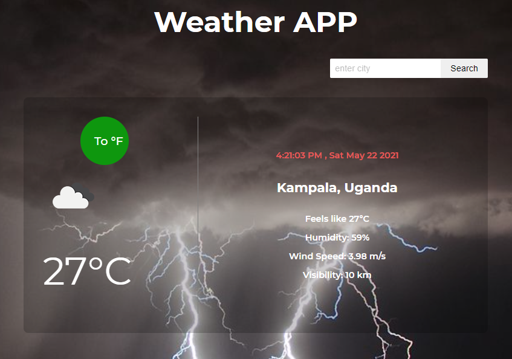

# Weather App
## About
Weather App is an application that gives the real-time weather conditions of a selected city in the world, designed using JavaScript with the help of OpenWeatherMap API. The application has the capability to toggle the temperature displayed to either Celsius or Fahrenheit.

## Snapshot



## Built With

- Javacript
- HTML
- CSS
- Webpack
- npm
- OpenWeatherMap-API

## Live Demo

[Live Demo Link](https://gango-anan.github.io/weather-app/)


## Getting started
To get started:

### Clone the repo: 
```
$ git clone https://github.com/gango-anan/weather-app.git

```

## Setup and run the application
### Install node.js:
```
First install node.js for your system
```
### Next, navigate to the project folder and install the dependencies using the following command:
```
$ npm install
```
## Run 
```
Run the application by launching your local webserver and lauching the index.html file in the browser
http://127.0.0.1:5500/dist/index.html
```
## Author

Galiwango Ananiya

- GitHub: [@gango-anan](https://github.com/gango-anan) 
- Twitter: [@gango_anan](https://twitter.com/gango_anan) 
- LinkedIn: [@galiwango-ananiya](https://www.linkedin.com/in/galiwango-ananiya-0800821b4/) 

## 🤝 Contributing

Contributions, issues, and feature requests are welcome!

Feel free to check the [issues page](https://github.com/gango-anan/weather-app/issues).

## Show your support

Give a ⭐️ if you like this project!

## Acknowledgments
- Credit goes to TheOdinProject.
- OpeanWeatherMap-API
- FreeCodeCamp


## 📝 License

This project is [MIT](https://github.com/gango-anan/weather-app/blob/master/LICENSE) licensed.
